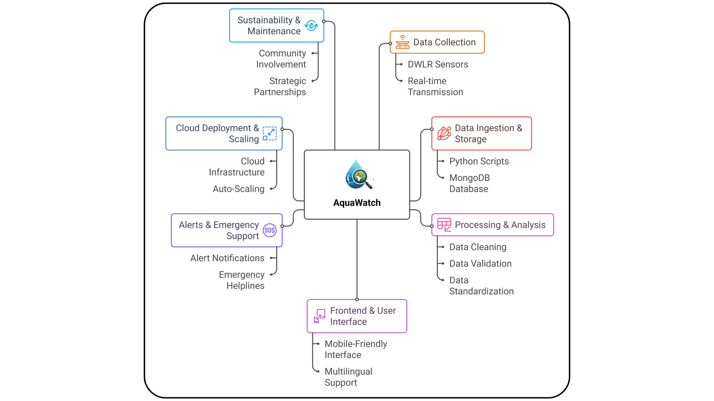

# 💧 AquaWatch 💧  

         

**🌍 Real-time Groundwater Monitoring System for India**  

AquaWatch is a comprehensive web application that provides **real-time monitoring and analysis** of India's groundwater crisis across all states and union territories using **Digital Water Level Recorder (DWLR) data from CGWB** (Central Ground Water Board).  

The platform offers **critical insights** into groundwater depletion, water availability, and population impact through an intuitive dashboard powered by 5,260+ DWLR sensor stations across India.

> 🚨 **India's groundwater is depleting at an alarming rate**. AquaWatch empowers citizens, policymakers, and researchers with real-time data to combat this crisis.

---

## 🏗️ Application Architecture  

### System Architecture Overview
AquaWatch operates through 4 integrated phases:

**PHASE 1: DATA ACQUISITION** → 5,260+ DWLR Sensors (CGWB Data)  
**PHASE 2: REAL-TIME PROCESSING** → FastAPI + Pandas (6-hour updates)  
**PHASE 3: PLATFORM & APP** → React Dashboard + Firebase Sync  
**PHASE 4: USER IMPACT** → Citizens, Policymakers, Researchers  

For detailed architecture diagrams and flow charts, see the attached architecture images above.

---

## ✨ Features  

### 🛠️ Admin Dashboard  
- 🌐 **National Water Crisis Overview**: Real-time monitoring of states in crisis with DWLR statistics  
- 🗺️ **State-wise DWLR Analysis**: Detailed breakdown of water conditions across all 28 states + 8 UTs using DWLR measurements  
- 📑 **Interactive State Cards**: Clickable cards with historical water level charts powered by DWLR sensors  
- 📈 **Trend Analysis**: Up/down/stable water level trends from DWLR data (meters below ground level - m bgl)  
- 👥 **User Management**: Admin panel for managing users and monitoring engagement  
- 🔄 **Real-time DWLR Sync**: Automatic updates from 5,260+ DWLR stations every 6 hours  

### 👤 User Dashboard  
- 📍 **Personal Groundwater Monitoring**: Real-time tracking for user's selected state using DWLR sensor data  
- 📊 **Real-time Graphs**: Interactive charts with DWLR historical trends and water level forecasts  
- 🚦 **Status Overview**: Visual indicators (Critical/Warning/Normal/Good) based on DWLR water level percentages  
- ⚡ **Quick Actions**: Easy access to emergency contacts and water conservation solutions  
- 📈 **Historical Analysis**: Multi-month trend data from DWLR measurements

### 🔐 Authentication & Security  
- 🧑‍💼 **Role-based Access**: Admin vs User dashboards with state-specific permissions  
- 🔑 **Firebase Authentication**: Secure email-based login  
- 📝 **User Registration**: Signup with state selection for personalized DWLR monitoring  
- 🔒 **Session Management**: Persistent secure sessions  

### 🚨 Emergency Response  
- 🔔 **Crisis Alerts Panel**: Real-time notifications for critical DWLR water levels  
- 🚑 **Emergency Response Modal**: Quick response procedures for groundwater crises  
- ☎️ **Emergency Contacts**: State-wise emergency helplines  
- 📱 **Alert System**: Critical level notifications  

### 💡 Solutions & Resources  
- 🌱 **Water Management Solutions**: Evidence-based conservation strategies  
- 📖 **Data Methodology**: Transparent DWLR data sources and processing pipeline  
- 🏛️ **Government Resources**: CGWB guidelines and official policies  
- 🔬 **Research Data**: Historical analysis from DWLR archives  

### 🎨 User Experience  
- 🌙 **Dark/Light Theme**: Automatic mode toggle  
- 📱 **Responsive Design**: Mobile-first for field monitoring  
- ⏳ **Loading Animations**: Smooth experience with custom spinners  
- ♿ **Accessible Interface**: WCAG compliant  
- 🧭 **Mobile Navigation**: Collapsible menu  
 
---

## 📂 Project Structure  

```
AquaWatch_1.0/
├── 🖥️ frontend/                    # React + TypeScript Web Application
│   ├── src/
│   │   ├── 📝 App.tsx             # Main application component
│   │   ├── 📄 main.tsx            # Entry point
│   │   ├── 🎨 index.css           # Global styles
│   │   ├── 💾 components/         # Reusable UI Components
│   │   │   ├── AdminDashboard.tsx         # 🔐 Admin panel with state analytics
│   │   │   ├── AdminLogin.tsx             # 🔑 Admin authentication
│   │   │   ├── AdminLoadingSpinner.tsx    # ⏳ Loading animation
│   │   │   ├── UserDashboard.tsx          # 👤 User's groundwater dashboard
│   │   │   ├── UserLogin.tsx              # 📝 User login page
│   │   │   ├── UserSignup.tsx             # ✍️ User registration
│   │   │   ├── UserDatabase.tsx           # 📊 User data management
│   │   │   ├── AlertsPanel.tsx            # 🚨 Alert notifications system
│   │   │   ├── EmergencyModal.tsx         # 🆘 Emergency response modal
│   │   │   ├── RealTimeGraph.tsx          # 📈 DWLR data visualization
│   │   │   ├── StateDetailsPopup.tsx      # 🗺️ State-specific water info
│   │   │   ├── Solutions.tsx              # 💡 Water management solutions
│   │   │   ├── DataMethodologyModal.tsx   # 📖 Data transparency info
│   │   │   ├── Authentication.tsx         # 🔐 Auth context component
│   │   │   ├── RoleSelection.tsx          # 👥 User role selector
│   │   │   ├── Header.tsx                 # 🎯 Navigation header
│   │   │   ├── Footer.tsx                 # 📌 Footer section
│   │   │   ├── LoadingScreen.tsx          # ⏳ Initial loading screen
│   │   │   ├── LoadingSpinner.tsx         # 🌀 Custom spinner
│   │   │   └── ThemeToggle.tsx            # 🌙 Dark/Light mode
│   │   ├── 🌐 contexts/           # Global State Management
│   │   │   ├── AuthContext.tsx           # 🔑 Authentication state
│   │   │   ├── ThemeContext.tsx          # 🎨 Theme configuration
│   │   │   └── WaterDataContext.tsx      # 💧 DWLR data state
│   │   ├── 🔥 firebase/           # Firebase Configuration
│   │   │   └── config.ts                 # Firebase initialization
│   │   ├── 📄 pages/              # Page-level Components
│   │   │   ├── LandingPage.tsx          # 🏠 Home/landing page
│   │   │   ├── AlertsPage.tsx           # 🚨 Alerts dashboard
│   │   │   └── SolutionsPage.tsx        # 💡 Solutions page
│   │   └── 🛠️ utils/              # Utility Functions
│   │       └── dataUtils.ts             # DWLR data parsing & conversion
│   ├── 📦 public/                 # Static assets
│   ├── 📋 package.json            # Node dependencies
│   ├── ⚙️ vite.config.ts          # Vite build configuration
│   ├── 🟦 tsconfig.json           # TypeScript configuration
│   └── 🧹 eslint.config.js        # ESLint rules
│
├── 🐍 backend/                    # Python FastAPI Server
│   ├── 🚀 main.py                # FastAPI application with DWLR data sync
│   │                              # - File watcher for CSV changes
│   │                              # - Batch upload to Firebase (≤500 writes)
│   │                              # - Real-time DWLR state synchronization
│   ├── 📊 data/
│   │   └── dwlr_india.csv        # 🔴 CGWB DWLR Dataset
│   │                              # - 5,260+ monitoring stations
│   │                              # - All 28 states + 8 UTs
│   │                              # - Water levels in meters below ground (m bgl)
│   │                              # - Updated every 6 hours
│   ├── 📋 requirements.txt        # Python dependencies (future)
│   └── 📑 .gitignore             # Ignore data & credentials
│
├── 📄 README.md                   # Project documentation
└── 📝 .env                        # Environment variables
```

---

## 🛠️ Technology Stack  

### 🎨 Frontend Stack
| Component | Technology | Version |
|-----------|-----------|---------|
| **Framework** | ⚛️ React | 19.2.1 |
| **Language** | 🟦 TypeScript | 5.5.3 |
| **Build Tool** | ⚡ Vite | 7.1.5 |
| **Styling** | 🎨 Tailwind CSS | 3.4.1 |
| **UI Components** | 💅 Styled-Components | 6.1.19 |
| **State Management** | 🔄 React Context API | Native |
| **Charting** | 📊 Recharts | 3.2.0 |
| **Icons** | 🎯 Lucide React | 0.344.0 |
| **Animations** | 🎬 Framer Motion | 12.23.12 |
| **Routing** | 🗺️ React Router v7 | 7.8.2 |
| **Firebase** | 🔥 Firebase SDK | 12.2.1 |
| **Linting** | ✅ ESLint | 9.9.1 |

### 🐍 Backend Stack
| Component | Technology | Version |
|-----------|-----------|---------|
| **Framework** | 🚀 FastAPI | 0.110 |
| **Server** | 🌐 Uvicorn | Latest |
| **Language** | 🐍 Python | 3.13.7 |
| **Data Processing** | 📊 Pandas | Latest |
| **Database** | 🔥 Firebase Firestore | Cloud |
| **File Monitoring** | 👀 Watchdog | Latest |
| **Environment** | ⚙️ Python-dotenv | Latest |

### ☁️ Cloud & Services
| Service | Purpose |
|---------|---------|
| 🔥 **Firebase** | Real-time Firestore database + Authentication |
| 📍 **Cloud Firestore** | `DWLR_state` collection for state-wise data |
| 🔐 **Firebase Auth** | Email/password authentication |

---

## ⚡ Getting Started

### 📋 Prerequisites

Before you begin, ensure you have:

- 📦 **Node.js** v18 or higher ([Download](https://nodejs.org/))
- 🐍 **Python** 3.8+ (for backend API - optional)
- 🛠️ **npm** or **yarn** package manager
- 🔥 **Firebase Account** (for backend connectivity - optional)
- 📊 **Git** for cloning the repository  

### 🔧 Installation  

1. **Clone the repository**

   ```bash
   git clone https://github.com/KGFCH2/AquaWatch_1.0.git
   cd AquaWatch_1.0
   ```

2. **Install frontend dependencies**

   ```bash
   cd frontend
   npm install
   ```

   > ⚠️ **Note**: If you encounter `styled-components` import errors, run:
   > ```bash
   > npm install styled-components @types/styled-components
   > ```

3. **Configure Firebase** (Optional - for backend API)
   
   Place your Firebase service account JSON key file in `backend/`. **Do not commit the key file or paste its contents into this README.**
   Use a descriptive filename (for example, `serviceAccountKey.json`) and set its path via the backend `.env` variable `FIREBASE_CREDENTIALS_PATH`.
   Ensure the key file is listed in `.gitignore`.

### ▶️ Development

1. **Start the frontend development server**

   ```bash
   cd frontend
   npm install
   npm run dev
   ```

   The application will be available at **`http://localhost:5173`** 🚀

   **Terminal Output Example:**
   ```
   VITE v7.1.5  ready in 450 ms
   ➜  Local:   http://localhost:5173/
   ➜  Press h to show help
   ```

2. **Build for production**

   ```bash
   npm run build
   ```
   
   Generates optimized build in `frontend/dist/` folder

3. **Preview production build locally**

   ```bash
   npm run preview
   ```

4. **Run linting to check code quality**

   ```bash
   npm run lint
   ```

### 🐍 Backend API Server (Optional - For DWLR Sync)

The backend processes DWLR CSV data and syncs with Firebase. It's **optional** for frontend-only development.

1. **Install Python dependencies**

   ```bash
   cd backend
   pip install fastapi uvicorn pandas firebase-admin watchdog python-dotenv
   ```

2. **Prepare DWLR CSV data**
   - Place `dwlr_india.csv` in `backend/data/` directory
   - File should contain: `State, Date, Time, Water_Level_m_bgl` columns

3. **Start the FastAPI server**

   ```bash
   python main.py
   ```

   The API will be available at `http://localhost:8000`

   **Features:**
   - 📡 **File Watcher**: Automatically detects CSV changes
   - 📤 **Batch Upload**: Uploads new rows to Firebase (≤500 per batch)
   - 🔄 **Incremental Sync**: Tracks last uploaded row index
   - ♻️ **Rollback Support**: Handles data deletion/rollback scenarios

## 🏗️ Application Architecture  



---

## 🖼️ Flowchart


## 📊 Data Sources & DWLR Dataset

### 🔴 Primary Data Source: DWLR Dataset (CGWB)

**Digital Water Level Recorder (DWLR)** - Automated groundwater monitoring network

| Metric | Details |
|--------|---------|
| 📈 **Total Stations** | 5,260+ DWLR monitoring stations across India |
| 🗺️ **Coverage** | All 28 states + 8 union territories |
| 📏 **Measurement Unit** | Meters Below Ground Level (m bgl) |
| ⏱️ **Update Frequency** | Every 6 hours (automated sync from CGWB) |
| 🔬 **Data Source** | Central Ground Water Board (CGWB), Ministry of Jal Shakti |
| 🎯 **Accuracy** | ±0.1 meters per CGWB specifications |
| 📋 **File Format** | CSV with State, Date, Time, Water_Level_m_bgl |

### 📝 DWLR CSV Data Structure

```csv
State,Date,Time,Water_Level_m_bgl
Andhra Pradesh,9/4/2025,0:00:00,6.56
Maharashtra,9/4/2025,6:00:00,15.89
Punjab,9/4/2025,12:00:00,8.21
Rajasthan,9/4/2025,18:00:00,42.15
```

**Fields Explained:**
- **State**: Indian state/UT name
- **Date**: Measurement date (MM/DD/YYYY)
- **Time**: Measurement time (HH:MM:SS)
- **Water_Level_m_bgl**: Water depth below ground surface in meters

### 🔄 Data Processing Pipeline

```
DWLR CSV File (CGWB)
    ↓ [Backend/Python]
Parse & Validate (Pandas)
    ↓
Filter Incomplete Rows
    ↓
Organize by State
    ↓ [Firebase Admin SDK]
Batch Upload to Firestore
    ↓ [DWLR_state Collection]
State → Subcollection (data)
    ↓ [Real-time Sync]
Firebase Listeners
    ↓ [Frontend/React]
Update Dashboard Components
    ↓
User Display (Charts, Maps, Alerts)
```

### 🎯 Water Level Status Classification

DWLR measurements are converted to percentage availability (0-100%):

| Water Level (% Availability) | Status | Color | Indicator | Action Required |
|-----|--------|-------|-----------|-----------------|
| **0-30%** | 🔴 **CRITICAL** | Red | Severe drought | 🚨 Immediate intervention |
| **31-50%** | 🟠 **HIGH STRESS** | Orange | Significant stress | ⚠️ Urgent action needed |
| **51-70%** | 🟡 **MODERATE** | Yellow | Monitoring needed | 👀 Close monitoring |
| **71-100%** | 🟢 **GOOD** | Green | Adequate supply | ✅ Normal conditions |

### 📚 Data Validation & Quality

The backend performs multiple quality checks:
- ✅ **Completeness**: Ensures all required fields are present
- ✅ **Format**: Validates date/time and numeric values
- ✅ **Range Check**: Confirms water levels are within realistic bounds (0-50m bgl)
- ✅ **Deduplication**: Prevents duplicate entries in Firebase
- ✅ **Incremental Updates**: Only syncs new/modified rows  

---

## 📐 Key Metrics & Thresholds

| Metric | Range | Status | Impact |
|--------|-------|--------|--------|
| **Water Level (% availability)** | 0-30% | 🔴 Critical | Severe drought conditions |
| **Water Level (% availability)** | 31-50% | 🟠 High Stress | Water rationing needed |
| **Water Level (% availability)** | 51-70% | 🟡 Moderate | Monitoring required |
| **Water Level (% availability)** | 71-100% | 🟢 Good | Adequate water supply |  

---

## ⚙️ Configuration & Setup

### 🔥 Firebase Configuration

Firebase is used for:
- 🔐 User authentication (Admin & User roles)
- 💾 Real-time database (Firestore)
- 📱 Data synchronization

#### Step 1: Create Firebase Project
1. Go to [Firebase Console](https://console.firebase.google.com)
2. Click **"Create a new project"**
3. Name it **"aquawatch"** (or your preferred name)
4. Enable Google Analytics (optional)

#### Step 2: Enable Firestore Database
1. Navigate to **Firestore Database** in left sidebar
2. Click **"Create Database"**
3. Choose **"Production mode"** → **"Next"**
4. Select region: **"asia-south1 (Delhi)"** → **"Enable"**

#### Step 3: Create Collections
1. In Firestore, create collection: **`DWLR_state`**
2. Set document ID as state name (e.g., `Maharashtra`)

#### Step 4: Get Firebase Config
1. Go to **Project Settings** (gear icon) → **"General"** tab
2. Copy your Firebase config details
3. Update `frontend/.env` with your credentials

### ⚡ Environment Variables

#### Frontend Configuration (`frontend/.env`)

```env
# Firebase Configuration
VITE_FIREBASE_API_KEY=YOUR_API_KEY
VITE_FIREBASE_AUTH_DOMAIN=YOUR_PROJECT.firebaseapp.com
VITE_FIREBASE_PROJECT_ID=your-project-id
VITE_FIREBASE_STORAGE_BUCKET=your-project.appspot.com
VITE_FIREBASE_MESSAGING_SENDER_ID=123456789
VITE_FIREBASE_APP_ID=1:123456789:web:xxxxx
VITE_FIREBASE_MEASUREMENT_ID=G-XXXXXXXXXX
```

#### Backend Configuration (`backend/.env`) - *Optional*

```env
# CSV Configuration
CSV_FILE=data/dwlr_india.csv

# Firebase Credentials
# Set this to the relative path of your service account JSON file (do NOT commit this file):
FIREBASE_CREDENTIALS_PATH=path/to/serviceAccountKey.json

# Firestore
COLLECTION_NAME=DWLR_state

# API Security
API_KEY=your-secure-api-key
```

**Security note:** Do not store actual API keys, service account JSON, or other secrets in `README.md`. Keep secrets in environment files (listed in `.gitignore`) or a secure secrets manager, and document only the variable names and how to set them.

### 🔒 Firebase Security Rules

Recommended Firestore security rules (in Firebase Console):

```javascript
rules_version = '2';
service cloud.firestore {
  match /databases/{database}/documents {
    // Allow authenticated users to read DWLR_state data
    match /DWLR_state/{state=**} {
      allow read: if request.auth != null;
      allow write: if request.auth.token.admin == true;
    }
    
    // Allow users to read/write their own user data
    match /users/{userId} {
      allow read, write: if request.auth.uid == userId;
    }
  }
}
```

---

## 🤝 Contributing  

We welcome contributions to improve **AquaWatch**!  

1. 🍴 **Fork** the repository  
2. 🌿 **Create** your feature branch (`git checkout -b feature/AmazingFeature`)  
3. 💾 **Commit** your changes (`git commit -m 'Add some AmazingFeature'`)  
4. 📤 **Push** to the branch (`git push origin feature/AmazingFeature`)  
5. 🔀 **Open a Pull Request**  

Please ensure your code follows the existing style guidelines and is well-documented.

### Development Guidelines
- Follow TypeScript strict mode
- Write unit tests for new features
- Ensure Firebase security rules are updated
- Update README for significant changes  

---

## 🆘 Support  

If you encounter any issues or bugs, please:  

- 📌 Check the [Issues](https://github.com/KGFCH2/AquaWatch_1.0/issues) page to see if it's already reported  
- 📝 If not, create a **new issue** with:  
  - 🖥️ Your OS and environment details  
  - ⚠️ Error messages/logs  
  - 📷 Screenshots (if applicable)  
  - 🔍 Steps to reproduce  

For general questions or suggestions, feel free to open a **discussion thread**.

---

## 🐛 Troubleshooting

### Common Issues & Solutions

| Issue | Solution |
|-------|----------|
| ❌ `styled-components` not found | `npm install styled-components @types/styled-components` |
| ❌ Port 5173 already in use | `npm run dev -- --port 3000` |
| ❌ Firebase connection fails | Check `.env` credentials, verify Firestore is enabled |
| ❌ DWLR data not syncing | Ensure CSV exists, check Firebase credentials |
| ❌ TypeScript errors | `rm -rf node_modules package-lock.json && npm install` |

---

## 📚 API Documentation

### Backend Endpoints (Optional FastAPI)

| Method | Endpoint | Description |
|--------|----------|-------------|
| `GET` | `/today-data` | Today's DWLR data for all states |
| `GET` | `/state-data` | DWLR data for specific state |
| `POST` | `/sync` | Manually trigger CSV→Firebase sync |

**Example Requests:**
```bash
# Get today's data
curl "http://localhost:8000/today-data?api_key=YOUR_API_KEY"

# Get state data
curl "http://localhost:8000/state-data?state=Maharashtra&api_key=YOUR_API_KEY"

# Trigger sync
curl -X POST "http://localhost:8000/sync?api_key=YOUR_API_KEY"
```

---

## 📊 Data Analytics

### Key Metrics Tracked

- 📈 **Water Level Trends**: Historical data analysis
- 🔴 **Crisis Index**: Real-time crisis status per state
- 👥 **User Engagement**: Active users per state
- 📍 **Regional Analysis**: State-wise comparisons
- ⏰ **Temporal Patterns**: Seasonal water variations

---

## 🌍 Impact  

### Our Mission
**To empower India with real-time groundwater intelligence and enable data-driven solutions to the nation's water crisis.**

### What We Achieve
- 📢 **Raise Awareness**: About India's critical groundwater crisis using verified DWLR data from CGWB
- 🚨 **Enable Fast Response**: Quick emergency response procedures for water crises
- 📊 **Data-Driven Policy**: Support government agencies with actionable insights
- 🌱 **Promote Conservation**: Provide community-level solutions and water saving tips
- 🤝 **Community Connect**: Link citizens with resources, NGOs, and emergency support

### Who Benefits

| User Group | Benefits |
|-----------|----------|
| 👥 **Citizens & Farmers** | Real-time water availability, conservation tips, emergency alerts |
| 🏛️ **Government Agencies** | DWLR analytics, policy support, crisis prediction |
| 🔬 **Researchers** | Historical trends, groundwater evaluation data |
| 📚 **NGOs & CSOs** | Community awareness tools, disaster management support |
| 📰 **Media & Journalists** | Data transparency, story angles on water crisis |

### Sustainable Development Goals

AquaWatch contributes to multiple UN SDGs:
- 🎯 **SDG 6**: Clean Water and Sanitation
- 🎯 **SDG 13**: Climate Action
- 🎯 **SDG 15**: Life on Land

---

## 📜 License

This project is licensed under the **MIT License** - see the LICENSE file for details.

Permission is hereby granted to use, copy, modify, and distribute this software for any purpose.

---

## 🤝 Contributing to AquaWatch

We welcome contributions from developers, data scientists, designers, and water experts!

### How to Contribute

1. 🍴 **Fork** the repository
2. 🌿 **Create** a feature branch: `git checkout -b feature/YourFeature`
3. 💻 **Make** your changes with clear, documented code
4. ✅ **Test** your changes locally
5. 📝 **Commit** with meaningful messages: `git commit -m 'Add YourFeature'`
6. 📤 **Push** to branch: `git push origin feature/YourFeature`
7. 🔀 **Create** a Pull Request

### Development Guidelines
- ✔️ Follow TypeScript strict mode
- ✔️ Add unit tests for new features
- ✔️ Update documentation in README
- ✔️ Maintain code consistency with ESLint
- ✔️ Write meaningful commit messages
- ✔️ Ensure Firebase security rules are updated

### Areas We Need Help With
- 🎨 **UI/UX Design**: Improve dashboard aesthetics
- 📱 **Mobile Optimization**: Better mobile responsiveness
- 🌐 **Internationalization**: Support regional languages
- 📊 **Data Visualization**: Enhanced charts and maps
- 🧪 **Testing**: Unit & integration tests
- 📚 **Documentation**: API docs, user guides
- 🐍 **Backend Features**: Advanced analytics, ML predictions

---

## 📞 Contact & Links

| Resource | Link |
|----------|------|
| 🐙 **GitHub Repository** | [KGFCH2/AquaWatch_1.0](https://github.com/KGFCH2/AquaWatch_1.0) |
| 👤 **Creator** | [@KGFCH2](https://github.com/KGFCH2) |
| 📧 **Email** | contact@aquawatch.org |
| 🌐 **Project Website** | [aquawatch.org](https://aquawatch.org) |
| 📚 **CGWB Portal** | [cgwb.gov.in](https://cgwb.gov.in) |
| 📚 **Ministry of Jal Shakti** | [jalsakhti.gov.in](https://jalsakhti.gov.in) |

### Acknowledgments

- 🏛️ **Central Ground Water Board (CGWB)** - For DWLR dataset and resources
- 🇮🇳 **Ministry of Jal Shakti** - Policy and guidance
- 💻 **Open Source Community** - React, Firebase, Tailwind, FastAPI ecosystem
- 👥 **Contributors & Users** - Your feedback and improvements

---

## 📈 Project Statistics

- ⭐ **Stars**: [Watch this repo!](https://github.com/KGFCH2/AquaWatch_1.0)
- 🐛 **Issues**: [Report bugs here](https://github.com/KGFCH2/AquaWatch_1.0/issues)
- 📝 **Discussions**: [Community forum](https://github.com/KGFCH2/AquaWatch_1.0/discussions)
- 📦 **Releases**: [Check releases](https://github.com/KGFCH2/AquaWatch_1.0/releases)

---

<div align="center">

### 🔵 Built for India's Water Security 🇮🇳

**💧 _Monitoring Groundwater. Managing Crisis. Empowering Communities._ 💧**

**_Every drop counts. Every state matters. Every action helps._**

---

 

Made with ❤️ for India's sustainable water future

🕒 **Last Updated**: December 6, 2025 | 📌 **Version**: 1.0.0 | 📍 **Status**: Active Development

---

[⬆ Back to top](#-aquawatch-)

</div>


